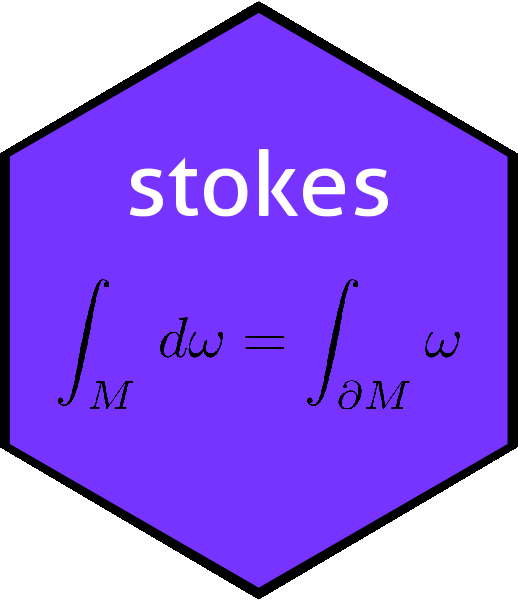

<!-- README.md is generated from README.Rmd. Please edit that file -->

```{r setup, include = FALSE}
knitr::opts_chunk$set(
  collapse = TRUE,
  comment = "#>",
  fig.path = "man/figures/README-",
  out.width = "100%"
)
```

# 

<!-- badges: start -->
[](https://travis-ci.com/RobinHankin/stokes)
[](https://cran.r-project.org/package=stokes)
[](https://codecov.io/gh/RobinHankin/stokes/branch/master)
<!-- badges: end -->

# Overview

The `stokes` package provides functionality for working with the
exterior calculus.  It includes cross products and wedge products and
a variety of use-cases.  The canonical reference would be Spivak (see
references).  A detailed vignette is provided in the package.

The package deals with $k$-tensors and $k$-forms.  A $k$-tensor is a
multilinear map $S\colon V^k\longrightarrow\mathbb{R}$, where
$V=\mathbb{R}^n$ is considered as a vector space.  Given two
$k$-tensors $S,T$ the package can calculate their outer product
$S\otimes T$ using natural R idiom (see below and the vignette for
details).

A $k$-form is an alternating $k$-tensor, that is a $k$-tensor $\omega$
with the property that linear dependence of $x_1,\ldots,x_n$ implies
that $\omega\left(x_1,\ldots,x_n\right)=0$.  Given $k$-forms
$\omega,\eta$, the package provides R idiom for calculating
their wedge product $\omega\wedge\eta$.

# Installation

You can install the released version of stokes from [CRAN](https://CRAN.R-project.org) with:

```{r, message=FALSE}
# install.packages("stokes")  # uncomment this to install the package
library("stokes")
set.seed(0)
```

# The `stokes` package in use

The package has two main classes of objects, `kform` and
`ktensor`.  We may define a $k$-tensor as follows

```{r ktensor}
KT <- as.ktensor(cbind(1:4,3:5),1:4)
KT
```

We can coerce `KT` to a function and then evaluate it:

```{r evaluatektensor}
KT <- as.ktensor(cbind(1:4,2:5),1:4)
f <- as.function(KT)
E <- matrix(rnorm(10),5,2)
f(E)
```

Cross products are implemented:

```{r crossprod}
KT %X% KT
```


## Alternating forms

An alternating form (or $k$-form) is an antisymmetric $k$-tensor; the
package can convert a general $k$-tensor to alternating form using the
`Alt()` function:


```{r showalt}
Alt(KT)
```

However, the package provides a bespoke and efficient representation
for $k$-forms as objects with class `kform`.  Such objects may be
created using the `as.kform()` function:

```{r example}

M <- matrix(c(4,2,3,1,2,4),2,3,byrow=TRUE)
M
KF <- as.kform(M,c(1,5))
KF
```

We may coerce `KF` to functional form:

```{r e2}
f <- as.function(KF)
E <- matrix(rnorm(12),4,3)
f(E)
```

# The wedge product

The wedge product of two $k$-forms is implemented as `%^%` or
`wedge()`:

```{r definekf2}
KF2 <- kform_general(6:9,2,1:6)
KF2
KF %^% KF2
```

The package can accommodate a number of results from the exterior
calculus such as elementary forms:

```{r dxdyxz}
dx <- as.kform(1)
dy <- as.kform(2)
dz <- as.kform(3)
dx %^% dy %^% dz  # element of volume 
```

A number of useful functions from the exterior calculus are provided,
such as the gradient of a scalar function:

```{r grad}
grad(1:6)
```

The package takes the leg-work out of the exterior calculus:

```{r legwork}
grad(1:4) %^% grad(1:6)
```


# References

The most concise reference is

  - Spivak 1971. _Calculus on manifolds_, Addison-Wesley.

But an accessible book would be

  - Hubbard and Hubbard 2015. _Vector calculus, linear algebra, and differential forms: a unified approach_.  Matrix Editions

# Further information

For more detail, see the package vignette

`vignette("stokes")`
